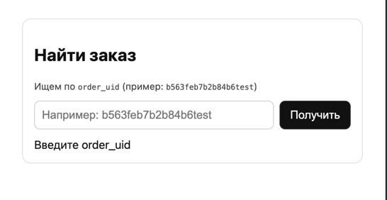

# 📦 Web Demoservice


Мини-сервис для обработки заказов: читает события из Kafka (Redpanda), сохраняет их в PostgreSQL и отдаёт через HTTP API и простую веб-страницу.

<p align="center">
  
</p>

---

##  Возможности
- Консьюмер Kafka (через [franz-go/kgo](https://github.com/twmb/franz-go))
- PostgreSQL (таблицы `orders`, `delivery`, `payment`, `item`)
- Upsert заказов и связанных сущностей
- Кэш заказов в памяти (по `order_uid`)
- HTTP API для получения заказа
- Простой фронтенд (`web/index.html`)

---

## ⚙️ Запуск

```bash
# собрать и запустить сервисы
docker compose up -d --build

# смотреть логи приложения
docker compose logs -f app

# открыть фронт в браузере
http://localhost:8081
